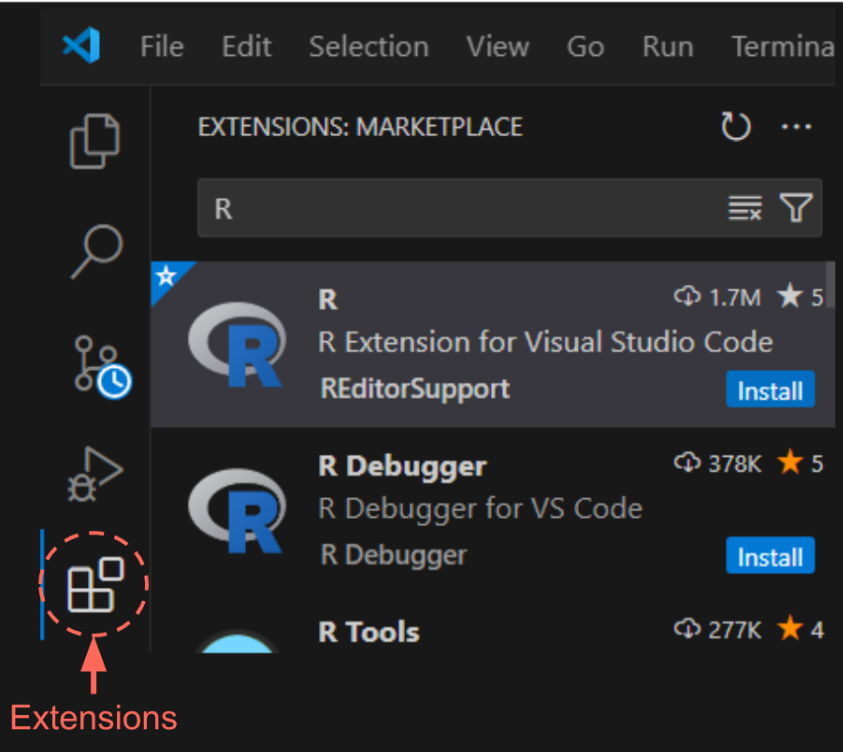
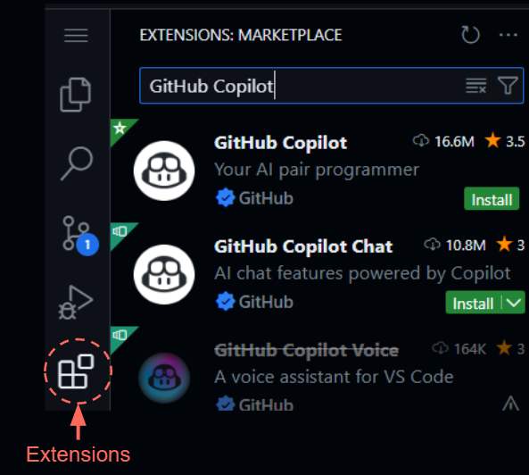

<h1>Setting up Visual Studio Code and GitHub Copilot</h1>

**Table of Contents**
- [1. GitHub Copilot](#1-github-copilot)
  - [1.1 Making a GitHub account](#11-making-a-github-account)
  - [1.1 Sign-up for Copilot](#11-sign-up-for-copilot)
- [2. Setting up Visual Studio Code](#2-setting-up-visual-studio-code)
  - [2.1 Installing Visual Studio Code](#21-installing-visual-studio-code)
  - [2.2 Setting up R in Visual Studio Code](#22-setting-up-r-in-visual-studio-code)
  - [2.2 Setting up GitHub Copilot in VS Code](#22-setting-up-github-copilot-in-vs-code)
- [3. FAQ](#3-faq)
  - [3.1 I am using windows and my VS Code can’t find R](#31-i-am-using-windows-and-my-vs-code-cant-find-r)
  - [3.1 Will I have to reinstall all my R packages in VS Code?](#31-will-i-have-to-reinstall-all-my-r-packages-in-vs-code)
  - [3.2 Where am I when I open VS Code?](#32-where-am-i-when-i-open-vs-code)

# 1\. GitHub Copilot

**Please sign-up for GitHub Copilot before the workshop.**

**If you are applying for free Copilot access as a student or teacher, the application is easy, however it can take a few days to process (GitHub warns it can even take _up to two weeks_, though we have not experienced this).**

In order to follow along in the workshop, you must have access to Copilot. If you are a student or teacher, you can get free access to Copilot, but you must first be verified (see [1.2 Sign-up for Copilot](#12-sign-up-for-copilot)). Otherwise, you will have to pay for a subscription, which starts at $10/month (plans available [here](https://github.com/features/copilot/plans)). If this is your first time using Copilot, you can also start a 30 day free trial. If you would like to run the workshop on your own computer (recommended) we also request that you install R and VS Code before the workshop (see [2\. Setting up VS Code](#2-setting-up-visual-studio-code)).

## 1.1 Making a GitHub account

To use GitHub Copilot you will need to create a GitHub account.

Steps:

1. Go to <https://github.com/>
2. Click Sign up
3. Sign up with your institutional email, if you have one. You can also add your institutional email later if you want to use another email (instructions [here](https://docs.github.com/en/account-and-profile/setting-up-and-managing-your-personal-account-on-github/managing-email-preferences/adding-an-email-address-to-your-github-account))
4. Follow the prompts to create your personal account. Pick your username carefully, you will likely not want to change it. Some recommendations (inspired by <https://happygitwithr.com/github-acct>):
    1. Use part of your real name so it is easier for people to know who you are
    2. Try and keep it short, you may have to type it a lot
    3. Keep everything lowercase. If you really want to separate words, use a hyphen (-) or an underscore (\_)

## 1.1 Sign-up for Copilot

GitHub Copilot is free for verified students and teachers. Otherwise, Copilot is $10/month or $100/year for their most basic individual account. You can get a free 30-day trial if it is your first time signing up.

If you are not a student or teacher, you can sign-up for a paid version of Copilot here:

<https://github.com/features/copilot/plans>

To get free Copilot for teachers and students you need to apply for benefits here (don’t worry, it’s easy!):

<https://education.github.com/discount_requests/application>

You will need to fill out a short application which will ask you some basic information about yourself and your institution. Your institutional email must be associated with your GitHub account (instructions for adding an email to your Github account can be found [here](https://docs.github.com/en/account-and-profile/setting-up-and-managing-your-personal-account-on-github/managing-email-preferences/adding-an-email-address-to-your-github-account)). You will need to provide proof of your affiliation. This proof must have **your name**, **a current date,** and **the name of your institution** on it. If your application is rejected, it is most likely because your proof of affiliation was missing one of these three things (but, you can always apply again with new proof!). For example, some UC Berkeley student IDs do not have a date on them, so they will not be accepted. You may also have to follow some additional steps to verify your GitHub account, make sure to check your email for instructions. We have also heard of a bug that results in **.png files not being accepted while .jpeg files are**.

If you are a UC Berkeley student, the most straightforward way to get proof is to download a certificate of enrollment verification by going to _CalCentral > My Academics > Enrollment Verification (under Academic Records) > View or Print Enrollment via Self Service > Obtain an enrollment certificate_. This will give you a PDF enrollment certificate which you can screenshot and submit for proof of affiliation (you need to use a screenshot because the application does not accept PDFs).

If you have a problem submitting your application please submit a D-Lab consulting request here with the subject line “GitHub Co-pilot workshop: applying for student developer pack”: <https://dlab.berkeley.edu/consulting/submit-consulting-request>

# 2\. Setting up Visual Studio Code

We will be using GitHub Copilot in Visual Studio Code (VS Code), a free code editor that allows you to work with a wide variety of languages including R, Python, and many others. If you have worked with RStudio before, you will find many parts of VS Code familiar.

Visual studio has extensive documentation describing how to setup and use VS Code, which can be found here:

<https://code.visualstudio.com/docs>

We summarize the steps described in their documentation below.

## 2.1 Installing Visual Studio Code

First, install VS Code onto your computer: <https://code.visualstudio.com/download>

Detailed setup instructions can be found here:

1. Mac - <https://code.visualstudio.com/docs/setup/mac>
2. Windows - <https://code.visualstudio.com/docs/setup/windows>
3. Linux - <https://code.visualstudio.com/docs/setup/linux>

Check out this video tutorial for a brief overview of VS Code: <https://code.visualstudio.com/learn/get-started/basics>

## 2.2 Setting up R in Visual Studio Code

The instructions below are mostly copied from the original VS Code documentation which can be found here: <https://code.visualstudio.com/docs/languages/r>

Steps:

1. If you don’t have R on your computer already, [Install R](https://cloud.r-project.org/) (>= 3.4.0) for your platform. **For Windows users, it is recommended to check “Save version number in registry” during installation so that the R extension can find your R installation automatically.** If you have not done this you may need to add the location of your R to your PATH manually (see FAQ [3.1 I am using windows and my VS Code can’t find R!](#31-i-am-using-windows-and-my-vs-code-cant-find-r)).
2. Install the “languageserver” and “httpgd” R packages in R
    1. Open a window in R (you can do this by either opening the R or RStudio app on your computer or using any other way you like to run R). _Sometimes, the R app seems to “disappear” in windows. If you can’t find your R app on your windows computer, click the windows icon on the bottom left of your screen, click “all apps”, scroll down until you find the R folder, and click the R version you want to run._
    2. Install the “languageserver” package by running: `install.packages(“languageserver”)`
    3.  In order to view our plots interactively we also want to install the “httpgd” package in R which we can do by running: `install.packages(“httpgd”)`

3. Install the R extension for VS Code. This “extension” is what allows R to access your installed R and use it to run your R code. VS Code has many extensions that allow you to do everything from running R to connecting to remote servers.
    1. Open VS Code
    2. Click on the Extensions icon in the toolbar on the left side 
   
    

    3. Look up “R” and click the “Install” button to install R
4. Done! Now you can run R code by either opening or creating an R file in VS Code (to create a file click _File > New File…_ and selecting R document or R markdown from the files). Note that VS Code uses lowercase .r and .rmd by default, but it will also accept .R and .Rmd files. To run R code, just click **“Ctrl + Enter”** and you will see your code run in a new R Interactive terminal window (analogous to the RStudio console)

## 2.2 Setting up GitHub Copilot in VS Code

To use GitHub Copilot in VS Code we will make use of the GitHub Copilot extension.

The instructions below are mostly copied from the original VS Code documentation which can be found here: <https://code.visualstudio.com/docs/copilot/setup>

More information about using Copilot in VS Code can be found here:

<https://code.visualstudio.com/docs/copilot/overview>

Steps:

1. Make sure you have an active GitHub Copilot subscription (see [1\. GitHub Copilot](#1-github-copilot)). VS Code will prompt you to sign-in to your GitHub account which has access to Copilot.
2. Install the GitHub Copilot extension
    1. Open VS Code
    2. Click on the Extensions icon in the toolbar on the left side
    
    

- 1. Look up “GitHub Copilot” and click the “Install” button to install Copilot. This will also automatically install “GitHub Copilot Chat”

1. Done! You will notice that a new chat bubble icon has been added to your left toolbar. Click on this button to start Copilot chat or click “Ctrl + Shift +I” to start Quick Chat and “Ctrl + I” to start in-line chat (see workshop materials or VS Code documentation for more information: <https://code.visualstudio.com/docs/copilot/getting-started>)

# 3\. FAQ

## 3.1 I am using windows and my VS Code can’t find R

If you are getting an error in VS Code that is something like “Cannot find R” this means that VS Code does not know where R is on your computer. To tell your computer (and VS Code) where your R is, we must add the location (known as the “path”) to your R installation to something called the “PATH”. The “PATH” is a list of folders that your computer looks at to find programs you want to run, like R. To add R to your PATH:

1. First, find the location (path) to your R installation:
    1. Open File Explorer
    2. Navigate to the directory where R is installed. By default, it is usually in C:\\Program Files\\R\\R-x.x.x\\bin (where x.x.x is the version number).
    3. Copy the path to the bin folder by right clicking on the bin folder and selecting “Copy as path” or “Ctrl+Shift+C”). It might look something like C:\\Program Files\\R\\R-4.4.0\\bin.
2. Add the R path to your system PATH:
    1. Option 1:
        1. Press “Win + X” keys on the keyboard and select _System_ from the list. Inside the System window, click on _Advanced system settings_
        2. Inside the advanced system settings, click on the _Environment Variables_ button at the bottom.
    2. Option 2:
        1. Click on the Search bar in the lower right hand of your screen
        2. Look up “Edit the system environmental variables” and click the suggestion
    3. Click on the _Environment Variables_ button at the bottom.
    4. Find the System variables section, and scroll down to find the _Path_ variable.
    5. Select it and click on _Edit_.
    6. In the _Edit Environment Variable_ window, click on _New_ and paste the path you copied earlier (for example: C:\\Program Files\\R\\R-4.4.0bin).
    7. Click _OK_ to close all windows.
3. Verify the R Path Addition:
    1. Open Command Prompt. You can do this by pressing “Win + R”, typing “cmd”, and hitting _Enter_.
    2. Type R --version and press _Enter_. If everything is set up correctly, you should see the version information for R displayed.
4. Make sure to restart VS Code (close all windows) in order for this change to take effect in VS Code.

## 3.1 Will I have to reinstall all my R packages in VS Code?

No, VS Code will reference your existing R installation, so whatever you have downloaded there will be in VS Code.

## 3.2 Where am I when I open VS Code?

When you open a new VS Code window you will see on the Welcome screen suggestions to open a file or a folder. If you open a folder (recommended), when you start running R you will be inside that folder (run **getwd()** to confirm this). If you open a file, you will be wherever your default working directory is – which is usually your user profile directory (e.g., C:\\Users\\&lt;YourUsername&gt; on windows).
